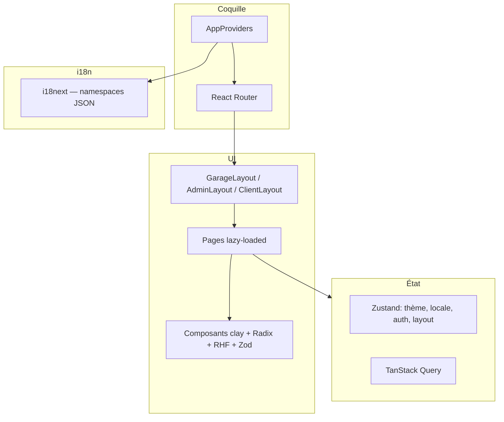

# GarageFlow — Frontend ERP atelier

Application **React 18 + Vite 5 + TypeScript 5.5** pour un ERP SaaS garages : interface **claymorphism** (verre dépoli, ombres douces), thème **clair / sombre**, **PWA**, **i18n FR / AR (RTL)** et navigation complète (tableau de bord, clients, véhicules, devis/factures, planning, stock, RH Kanban, fidélisation, vitrine, IA, super-admin, portail client).

## Prérequis

- Node.js 20+ recommandé  
- npm 10+

## Installation

```bash
npm install
```

Générer les icônes PWA à partir de `public/favicon.svg` (déjà présentes si vous n’avez pas besoin de régénérer) :

```bash
npm run icons
```

## Scripts

| Commande        | Description                          |
|-----------------|--------------------------------------|
| `npm run dev`   | Serveur de développement Vite        |
| `npm run build` | Build production (tsc + vite build)  |
| `npm run preview` | Prévisualisation du build          |
| `npm run lint`  | ESLint                               |
| `npm run analyze` | Build + rapport bundle (`dist/stats.html`) |

## Architecture (aperçu)



## Structure `src/`

- `app/` — `App.tsx`, `router.tsx`, `providers.tsx`
- `layouts/` — mises en page garage, admin, client
- `pages/` — écrans par domaine (lazy)
- `components/` — design system (`ui/`), layout, partagés
- `store/` — Zustand (thème, locale, auth, layout)
- `i18n/locales/` — `fr.json`, `ar.json`
- `mocks/` — données françaises de démonstration
- `types/` — modèles TypeScript

## PWA

- **vite-plugin-pwa** (Workbox) : précache des assets, stratégies réseau / cache, mise à jour automatique du SW.
- Manifest : couleurs `theme_color` / `background_color`, icônes dans `public/icons/`.
- Page hors ligne : `public/offline.html`.
- Bannière d’installation : `PwaInstallBanner` (événement `beforeinstallprompt`).

## Notes techniques

- **Planning** : calendrier avec **react-big-calendar** + **date-fns** (compatible bundler / CSS). Les paquets `@fullcalendar/*` ne sont pas utilisés dans ce dépôt pour éviter les problèmes d’exports CSS en build ; la dépendance listée dans le cahier des charges est couverte par **react-big-calendar** comme alternative prévue.
- **Accessibilité** : lien « Aller au contenu », focus visible, `aria-*` sur les interactions principales ; respect de `prefers-reduced-motion` au niveau CSS global.

## Licence

Projet de démonstration — adaptez la licence selon votre produit.
